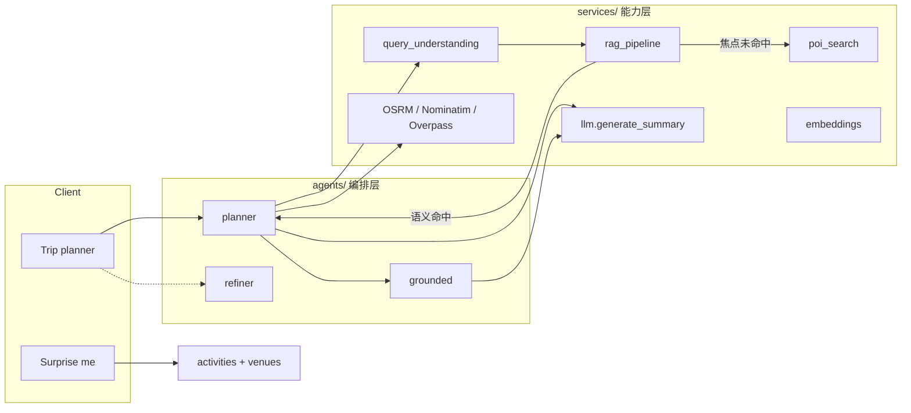

# Travel-Agent 完整项目技术分析

> 从前端到后端的系统剖析，**重点展开 AI Agent 开发形态、编排与落地细节**。  
> 选型「为什么不用 X」→ [架构技术选型.md](./架构技术选型.md)  
> 运行方式 / API 速查 → [PROJECT_OVERVIEW.md](../PROJECT_OVERVIEW.md)

---

## 1. 产品与问题定义

本项目不是通用 Chatbot，而是面向北美「说走就走」场景的 **旅行规划 Agent 产品**：

| 维度 | 定义 |
|---|---|
| 输入 | 出发地 + 车程/飞行约束，或中英自然语言（「附近冲浪」「扔斧头」） |
| 输出 | **可验证地点** + **可执行逐日行程** + 候选列表 |
| 双入口 | **Surprise me**（今天干嘛）与 **Trip planner**（短途出行） |
| 客户端 | **iOS 主产品**（SwiftUI）；**Web Beta**（同构 UI，便于本机 / 同网调试评测） |

硬约束决定了 Agent 不能「自由发挥地点」：

1. 地点必须真实且可规划  
2. 车程 / 飞行必须硬过滤  
3. 说法开放（中英、新玩法）  
4. 本地可演示、可降级（无 key 也能跑通）

---

## 2. 总体架构

```
┌──────────────── iOS (主) / Web Beta ────────────────┐
│  Surprise me │ Trip planner │ Account │ Feedback    │
└───────────────────────┬─────────────────────────────┘
                        │ HTTPS / JWT
                        ▼
┌──────────────────── FastAPI ────────────────────────┐
│  routers: plan/search/activities/account/taste/beta │
│                                                     │
│  agents/     ← 业务流程编排（Planner / Grounded / …）│
│  services/   ← 可替换能力（RAG / LLM / POI / Geo）   │
│  knowledge/  ← 闭域可规划语料                         │
│  data/       ← SQLite + embed cache + feedback JSONL│
└─────────────────────────────────────────────────────┘
```

**分层原则：**

| 层 | 职责 | 换什么时动它 |
|---|---|---|
| `agents/` | 「先检索再接地生成」的业务流程 | 产品流程变了 |
| `services/` | embedding、LLM、OSRM、Nominatim… | 换供应商 / 模型 |
| `knowledge/` | 精选目的地 → RAG 文档 | 扩目录 |
| 客户端 | 模式切换、展示、账号 | UI / 分发渠道 |

这是 **编排型 Agent（Orchestrated Agent）**，不是让模型自己循环选 Tool 的自治 Agent。

---

## 3. 技术栈一览

| 层 | 技术 |
|---|---|
| iOS | SwiftUI、URLSession、Keychain JWT、UserDefaults 环境切换 |
| Web | React 19、Vite、TypeScript、手写 CSS（贴纸风同构 iOS） |
| 后端 | Python 3.10+、FastAPI、Pydantic v2、SQLAlchemy 2、httpx、Uvicorn |
| LLM | OpenAI 兼容协议（DashScope / OpenAI / Ollama / 其他兼容端均可配置） |
| Embedding | `api` 或 **local**（`BAAI/bge-small-en-v1.5`）+ 磁盘缓存 |
| 地理 | Nominatim、Overpass、OSRM、Leaflet（Web 历史路径；当前 Beta 无地图侧栏） |
| 数据 | SQLite（用户/行程/评价/人格/趋势点）、`.embed_cache.json`、`beta_feedback.jsonl` |
| 可观测 | OpenTelemetry spans、Prometheus `/metrics`、结构化日志 |

---

## 4. 前端技术分析

### 4.1 双端同构产品模型

首页只有两个互斥模式，刻意不做「万能聊天页」：

| 模式 | 用户意图 | API |
|---|---|---|
| **Surprise me** | 临时找玩法，不一定要「过夜行程」 | `POST /api/activities` → venues |
| **Trip planner** | 短途出行：约束 chips 或自然语言 | `POST /api/plan` 或 `/api/search` → `/api/select` |

**设计含义（对 Agent）：**  
Surprise 与 Planner 是两条不同的 AI 管线——前者是 **开放词表活动推荐 + 附近场馆解析**；后者是 **闭域 RAG + 接地行程生成**。前端模式开关直接对应后端 Agent 入口，避免把所有能力塞进一个 `/chat`。

### 4.2 iOS（主产品）

| 模块 | 路径 | 作用 |
|---|---|---|
| App / 首页 | `ios/TravelAgent/ContentView.swift` | 模式切换、主交互壳 |
| Surprise | `ActivitiesViewModel.swift` | 拉想法列表、点「附近」 |
| Planner | `TripViewModel.swift` | 空 query → plan；有字 → search；展开候选 → select |
| 网络 | `APIClient.swift` | 统一 Base URL + Bearer |
| 环境 | `Config.swift` | Local / Beta / Custom，DEBUG 默认本机 |
| 账号 | `AccountView.swift` + `AuthStore.swift` | 登录、人格测验、行程/评价 |
| 主题 | `Theme.swift` + Icons | Cute sticker 视觉 |

环境切换是工程能力，不是 Agent 能力：同一套 Agent API，切 `127.0.0.1:8000` 或未来公网 Beta。

### 4.3 Web Beta

| 模块 | 路径 | 作用 |
|---|---|---|
| 壳 | `frontend/src/App.tsx` | 与 iOS 同构的模式与账号入口 |
| Surprise / Planner | `SurprisePanel.tsx` / `PlannerPanel.tsx` | 对应双管线 |
| 候选 | `CandidatesAccordion.tsx` | 展开调 `/api/select` |
| API | `api/client.ts` + `endpoints.ts` | 代理到 FastAPI |
| 反馈 | `BetaFeedback.tsx` | 匿名 `POST /api/beta/feedback` |
| i18n | `i18n.tsx` | 中英 |

Vite `host: true` 便于同 Wi‑Fi 局域网访问（手机打开 `http://<本机局域网IP>:5173`）。**不要**在公司设备上使用公网隧道类工具；外测用局域网或后续正规托管/TestFlight。

### 4.4 前端与 Agent 的契约

客户端 **不** 做意图理解、检索或 grounding；只做：

1. 组装请求（origin、prefs、query、language、companion…）  
2. 展示 candidates / itinerary / activity cards  
3. 可选带 JWT，让后端注入 persona / memory / taste  

**Agent 智能全部在服务端。** 前端换皮（iOS ↔ Web）不应改变规划结果分布。

---

## 5. 后端技术分析

### 5.1 入口与路由

`backend/app/main.py` 挂载核心规划 API；账号 / taste / beta 分 router。

| Endpoint | Agent 入口 | 说明 |
|---|---|---|
| `POST /api/plan` | `agents.planner.create_plan` | chips 约束主路径 |
| `POST /api/search` | `search_destinations` | 自然语言双路径 |
| `POST /api/select` | `plan_for_destination` | 候选展开成完整行程 |
| `POST /api/fly-*` | fly 规划 / 报价 | 飞行轴 |
| `POST /api/activities` | `services.activities` | Surprise 推荐 |
| `POST /api/activities/venues` | `activity_venues` | 想法 → 附近真实点 |
| `POST /api/chat` | `agents.refiner.refine` | 行程后轻量 refine |
| `POST /api/discover` | experiences / trending | 发现流 |
| Account / Taste / Beta | routers | 个性化与反馈闭环 |

### 5.2 配置与可替换 LLM

`backend/app/config.py` 从仓库根 `.env` 读取：

| 变量 | 作用 |
|---|---|
| `LLM_PROVIDER` | `openai` / `anthropic` / `template` |
| `OPENAI_BASE_URL` + `OPENAI_MODEL` + `OPENAI_API_KEY` | 任意 OpenAI 兼容端（Ollama / DeepSeek / 云厂商等） |
| `EMBEDDING_BACKEND` | `api` \| `local` |
| `LOCAL_EMBED_MODEL` | 本地向量模型 |
| `RERANK_*` | 可选 cross-encoder |

运行时通过 `.env` 配置聊天模型与 embedding（可 `api` 或 `local`）。业务代码只依赖 OpenAI 兼容 `chat.completions`，换 endpoint 不改编排逻辑。密钥只放本机 `.env`，不进仓库。

### 5.3 数据层

| 存储 | 内容 |
|---|---|
| SQLite | User、Trip、PlaceReview、FeedbackEvent、TrendingSpot、TasteSnippet、persona |
| 内存向量 | 语料规模小，全量 cosine；向量缓存在 `knowledge/.embed_cache.json` |
| JSONL | Web beta 匿名反馈 |
| 目录常量 | `destinations.py` / `fly_destinations.py` / `activity_catalog.py` |

**没有**独立向量库（Milvus/Pinecone）：语料量级不值得上；这是有意的 MVP 边界。

### 5.4 行程语义轴（产品逻辑，影响检索打分）

`services/trip_scope.py` 把「远近」与「玩法意图」拆开：

| 轴 | 取值 | 含义 |
|---|---|---|
| Drive band | `local` / `regional` / `distant` | ≤3h / 3–5h / ≥5h |
| Travel mode | `drive` \| `fly` | 用户切换，不与 distant 强绑 |
| `trip_kind` | `local_play` \| `away` | ≤5h 自驾短途游 vs 长途或飞行「离开本地」 |

Agent 排序用 `distance_preference` 做软偏好；硬过滤仍在约束引擎 / `_metadata_ok`。

---

## 6. AI Agent 开发（核心）

### 6.1 我们说的「Agent」是什么

业界常混用几个词。本项目的定位：

| 形态 | 本项目？ | 说明 |
|---|---|---|
| **Orchestrated / Pipeline Agent** | ✅ | 固定步骤编排，LLM 只在关键步调用 |
| ReAct / Tool-calling 循环 | ❌ | 无 `tool_calls`、无自主选工具循环 |
| LangGraph / Crew 多智能体 | ❌ | 强约束场景自研管线更清晰 |
| 纯 Chat Agent | ❌ | 地点幻觉与车程不可靠 |

**一句话：**  
检索与硬约束决定「去哪」；LLM 在接地上下文里写「怎么玩」；校验挡住幻觉。这是 **旅行规划 Agent**，不是通用对话 Agent。



### 6.2 Agent 目录与职责

| 文件 | 角色 | 关键函数 |
|---|---|---|
| `agents/planner.py` | 主编排器 | `create_plan` / `search_destinations` / `plan_for_*` |
| `agents/grounded.py` | 接地生成器 | `generate_grounded_days` / `validate_grounded_output` |
| `agents/refiner.py` | 轻量对话 refine | `refine`（规则优先，再 RAG+LLM） |
| `agents/ingest.py` | 后台社媒事实沉淀 | 非请求路径 Agent |

`planner` 负责 **状态机式流水线**（检索 → 过滤 → 增强 → 摘要 → 接地），而不是维护多轮对话状态机。

### 6.3 LLM 调用面（刻意收窄）

`services/llm.py` 核心只有：

- `generate_summary(prompt, json_mode=False)` — 单次补全  
- `parse_itinerary_json` — 从模型输出抠 JSON  
- `fetch_weather_note` — 天气旁路  

**没有** streaming、**没有** function calling、**没有** 多轮 tool loop。  
好处：延迟可控、失败可降级、评测边界清晰。代价：复杂多跳推理要写进 Python 编排，而不是交给模型「自己想下一步」。

LLM 出现在这些 **定点**：

| 调用点 | 目的 | 失败时 |
|---|---|---|
| `llm_activity_phrase` | 中英开放说法 → 2–5 词英文活动短语 | 关键词 / 原文降级 |
| `rewrite_query` | 合成检索 query | 规则拼装 |
| plan summary | 2–3 句人话推荐文案 | i18n / 目录模板 |
| `generate_grounded_days` | JSON 逐日活动 | 回退目录 `day_activities` |
| refine / ingest 抽地点 | 改写或事实抽取 | 跳过或空结果 |

### 6.4 RAG Agent 主循环（Trip Planner）

`services/rag_pipeline.py` 的 `RAGPipeline.run` 是检索大脑：

```
understand → rewrite → retrieve → hard filter → score(搜/推/广) → rerank? → context_blocks
```

#### Step 细节

1. **Understand**（`query_understanding`）  
   - 规则抽意图：天数、车程暗示、风景 specialty、焦点词  
   - 有 focus 时：`llm_activity_phrase` 得到英文活动短语（解决「冲浪」对不上英文语料）

2. **Rewrite**  
   - 合并 UI prefs + activity phrase → 检索 query

3. **Retrieve**  
   - `build_corpus(DESTINATIONS + FLY_DESTINATIONS)`  
   - `embed_texts` / `embed_query`（可本地）  
   - 无向量则关键词回退

4. **Hard filter**（`_metadata_ok`）  
   - 超过 `max_drive_hours` 的自驾目的地剔除  
   - 极光等 specialty 的纬度 / 文本门槛  
   - **相关性永远压不过可行性**

5. **Score 融合**  
   - 语义 cosine、关键词、距离偏好（`trip_scope`）  
   - 天气 / 人气 / 新鲜度信号  
   - persona + **搜/推/广**（当下相关 / 记忆推 / 新颖探索）  
   - focus 语义门控：`_FOCUS_SEMANTIC_MIN=0.55` 等，避免「不像就硬推国家公园」

6. **Rerank（可选）**  
   - cross-encoder 精排 Top-N

7. **Assemble**  
   - `context_blocks` 注入后续生成（**不只排序**——这是 RAG 价值放大的关键）

### 6.5 双路径：Corpus vs POI

`search_destinations` 在 RAG 之后分支：

| 路径 | 条件 | 行为 |
|---|---|---|
| **Path A `corpus`** | 语义焦点命中闭域目录 | `plan_for_destination` / fly |
| **Path B `poi`** | 有 focus 且语料不像（如「扔斧头」） | `poi_search` → Nominatim → `plan_for_poi` |
| **`corpus-approx`** | 放宽后仍弱命中 | 近似目录，避免死胡同 |

这是 Agent 的 **策略路由**，用 Python if/else + 语义分数实现，而不是让 LLM 决定「要不要搜 OSM」。

### 6.6 接地生成（Grounded Generation）

检索定地点后，`planner` 并行拉增强：天气、Overpass 餐饮玩乐、活动、社媒趋势点 → 拼进 prompt。

`agents/grounded.py`：

1. Prompt 约束：**Using ONLY the grounded facts**  
2. `json_mode` 要求 `{"activities":[...]}`  
3. `validate_grounded_output`：对照已知 POI / context 算 groundedness / hallucination_rate  
4. 不合格 → 目录骨架回退  

**职责分离（Agent 设计核心）：**

| 谁 | 负责 | 为什么 |
|---|---|---|
| RAG / POI | 去哪 | 可验证、可评测 |
| LLM | 日程叙事与节奏 | 语言能力 |
| `validate_*` | 防偷加景点 | 产品可信度 |

### 6.7 Surprise me：另一条轻量 Agent

不走行程 RAG，而是 **活动目录推荐 Agent**：

```
interests / companion / energy / 可选 free-text
  →（登录）taste_profile 向量
  → embed activity_catalog
  → 季节 × 同伴 × 体力 × 预算 × 天气打分
  → vibe 桶多样化
  → ActivitySuggestion[]

「附近去哪」
  → activity_key → 预置英文 Nominatim 短语
  → 趋势库 / 附近真实场馆
```

同样遵循：**模型/向量负责「像什么玩法」，地理 API 负责「真实在哪」**。

### 6.8 个性化如何进入 Agent

| 机制 | 注入阶段 | 作用 |
|---|---|---|
| Persona quiz | 检索打分 + prompt | 偏好轴 |
| User memory 向量 | 搜/推/广融合 + context | 历史泛化（爱海岸 ≠ 只加分去过的点） |
| Taste snippets | Surprise / discover | 开放词表口味 |
| 行程/评价 | 记忆索引 | 闭环 |

UI **故意不展示**原始 搜/推/广 分数；对人展示「推荐理由」文案。

### 6.9 降级与可演示性（Agent 工程必选项）

| 依赖挂了 | 行为 |
|---|---|
| 无 LLM key / `template` | 目录 day plan + 模板摘要 |
| 无 embedding | 关键词检索 |
| OSRM 失败 | haversine 估算车程 |
| 天气/社媒/航班失败 | best-effort 跳过 |
| Grounded JSON 解析失败 | 目录骨架 |

**Agent 可用性 = 编排在任意能力缺失时仍有确定性输出。** 这比「接一个更强模型」更决定产品能不能演示。

### 6.10 与主流 Agent 框架对比（实现视角）

| 能力 | LangChain/LlamaIndex 典型做法 | 本项目 |
|---|---|---|
| 检索 | VectorStore retriever | 自研 `RAGPipeline` + 内存语料 |
| 工具 | Tool + AgentExecutor | Python 直接调 `poi_search` / OSRM |
| 记忆 | Memory 抽象 | `user_memory` + SQLite |
| 可观测 | Callback | OTel + 自有 validation 字段 |
| 控制流 | Chain / Graph | `planner` 显式 async 流水线 |

强约束（车程硬过滤、极光门控、双路径、搜广推权重）是一等公民写在代码里；框架的通用抽象收益变小、失败模式变难讲清。详见选型文档 §2.5。

### 6.11 评测与可观测（Agent 质量闭环）

- `backend/app/eval/`：RAG 用例与脚本（目的地名 P@K 方向）  
- SearchResponse 带回 `search_path`、`validation`、`context_blocks`、intent —— **Agent 决策可调试**  
- Tracing 定位慢在 embed / OSRM / LLM  

外测：Web Beta Feedback → JSONL，低成本收集「推荐是否靠谱」。

---

## 7. 端到端数据流

### 7.1 Trip planner（自然语言）

```
用户输入「想附近冲浪」
  → iOS TripViewModel / Web App
  → POST /api/search
  → extract_intent + llm_activity_phrase("surfing")
  → RAGPipeline：硬过滤车程 → 语义命中 Santa Cruz 等
  → plan_for_destination
  → 并行：天气 / OSM / events / social
  → generate_summary（短文案）
  → generate_grounded_days + validate
  → SearchResponse { itinerary, candidates, search_path, … }
  → UI 手风琴；点其他候选 → /api/select
```

### 7.2 Trip planner（仅 chips）

```
空 query + max_drive_hours + prefs
  → POST /api/plan
  → find_candidates（硬约束）
  → 合成 query → 同一 RAG 重排（避免 RAG 摆设）
  → 同上 grounding
```

### 7.3 Surprise me

```
POST /api/activities → 想法卡片
POST /api/activities/venues → 附近真实场馆 + 车程
```

---

## 8. 社媒与合规（Agent 外围数据）

后台 `agents/ingest.py`：多平台扇入 → LLM 抽地名 → Nominatim 核实 → `TrendingSpot` **只存事实**（名、坐标、类别、平台标记），不存原文图文。

请求路径优先读库，避免每请求抓社媒。合规细节见选型文档 §12 与 `product-data-compliance-architecture`（若存在）。

---

## 9. 工程实践与部署形态

| 场景 | 做法 |
|---|---|
| 本地开发 | backend `:8000` + iOS Local / Vite proxy |
| 外测 Web | 同 Wi‑Fi 访问 Vite LAN 地址；或后续正规托管 |
| 未来 iOS Beta | 填 `BetaAPIBaseURL`；TestFlight 另议 |
| 密钥 | 根目录 `.env` gitignore；勿提交 |
| 模型切换 | 改 `OPENAI_*` / `EMBEDDING_BACKEND` 重启 uvicorn |

---

## 10. 架构优缺点与演进方向

### 已验证的优点

- **地点可验证**：闭域 + POI + grounding 校验  
- **开放说法**：LLM 短语 + embedding，不靠同义词表堆砌  
- **双端同构**：同一 Agent API，iOS/Web 换皮  
- **可降级**：简历/演示不绑死单一云厂商  
- **Agent 边界清晰**：编排在 Python，模型做语言与结构化生成  

### 诚实限制

- POI 仍是 Nominatim 词面检索，不是全量语义地点库  
- 无 streaming / 多轮 tool Agent，复杂协商交互弱  
- 语料规模小，向量库与图框架尚未必要  
- 本地 embedding 跨语言弱，依赖「先英文化」  

### 何时升级 Agent 形态

| 触发条件 | 可能动作 |
|---|---|
| 语料到万级 + 增量更新 | pgvector / 专用向量库 |
| 需要多跳「比价+订票+改期」 | 有限 Tool-calling 或图状态机 |
| 要实时打字体验 | SSE/WebSocket streaming |
| 当前 LLM 端不可用 | 改 `.env` 切其他 OpenAI 兼容端（配置级，无需改代码） |

---

## 11. 面试 / 技术分享可背提纲

1. **问题**：说走就走 ≠ 聊天；地点幻觉与车程是生死线。  
2. **Agent 形态**：Orchestrated Pipeline，不是 ReAct。  
3. **核心闭环**：检索定 where → 接地 LLM 写 how → validate。  
4. **双路径**：Corpus 精品 vs POI 开放玩法。  
5. **个性化**：搜推广在检索期就生效，不只塞 profile 字符串。  
6. **工程**：OpenAI 兼容一层多后端；embedding 可本地；全链路降级。  
7. **产品壳**：iOS 主路径 + Web Beta 同构外测。  

---

## 12. 相关文档

| 文档 | 内容 |
|---|---|
| [架构技术选型.md](./架构技术选型.md) | 为什么用 A 不用 B |
| [PROJECT_OVERVIEW.md](../PROJECT_OVERVIEW.md) | 运行、目录、API |
| [AI_CONCIERGE_PLANNER_PROMPT.md](./AI_CONCIERGE_PLANNER_PROMPT.md) | Concierge 提示词设计备忘 |
| [amplify-rag-value-design](./superpowers/specs/2026-07-09-amplify-rag-value-design.md) | 检索上下文如何进入生成 |

---

*文档对应仓库当前实现：FastAPI agents/services 分层、iOS + Web 双模式；LLM/embedding 由本地 `.env` 配置。*
